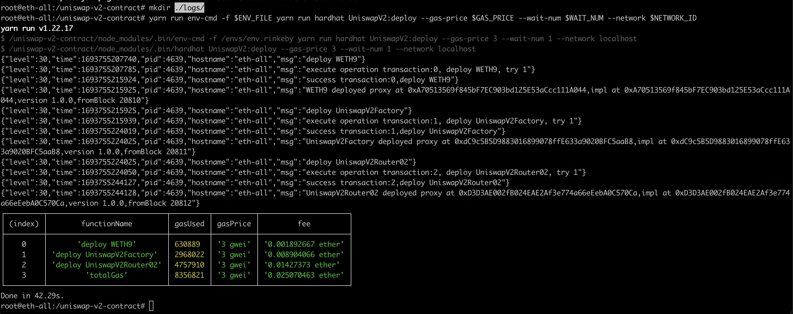

# 部署geth
```bash
docker run -itd --restart=always --net=host --name=geth-01 ubuntu
docker exec -it geth-01 bash
#!/bin/bash
apt update && apt install wget vim screen -y
wget https://gethstore.blob.core.windows.net/builds/geth-linux-amd64-1.11.6-ea9e62ca.tar.gz
tar -zxvf geth-linux-amd64-1.11.6-ea9e62ca.tar.gz
mv geth-linux-amd64-1.11.6-ea9e62ca/geth /bin/geth
rm -rf geth-linux-amd64-1.11.6-ea9e62ca
rm -rf geth-linux-amd64-1.11.6-ea9e62ca.tar.gz
```

```bash
cat <<EOF >> ~/geth.json
{
    "config": {
            "chainId": 4336,
            "homesteadBlock": 0,
            "byzantiumBlock": 0,
            "constantinopleBlock": 0,
            "eip150Block": 0,
            "eip155Block": 0,
            "eip158Block": 0
    },
    "alloc": {
	    "0x9feee155032dCcD5F090299416E02f986919E1ad": {
	    	"balance": "0x1000000000000000000"
	    }
    },
    "coinbase"   : "0x0000000000000000000000000000000000000000",
    "difficulty" : "0x20000",
    "extraData"  : "",
    "gasLimit"   : "0x2fefd8",
    "nonce"      : "0x0000000000000042",
    "mixhash"    : "0x0000000000000000000000000000000000000000000000000000000000000000",
    "parentHash" : "0x0000000000000000000000000000000000000000000000000000000000000000",
    "timestamp"  : "0x00"
}
EOF

geth --datadir ~/nodedata --networkid 4336 init ~/geth.json
geth --datadir ~/nodedata account new # 生成密码 passwd
cat <<EOF >> ~/passwd
passwd
EOF

cat <<EOF >> ~/start_geth.sh
geth  --ethash.cachedir ~/Ethash --ethash.dagdir ~/Ethash --allow-insecure-unlock  --unlock=0  --password  ~/passwd  --networkid  4336  --datadir  ~/nodedata  --http --http.api "admin,debug,web3,eth,txpool,personal,ethash,miner,net" --http.corsdomain="*" --http.port=8545 --http.addr="0.0.0.0"  --ws --ws.addr "0.0.0.0" --ws.port=8546 --ws.origins "*" --ws.api "admin,debug,web3,eth,txpool,personal,ethash,miner,net" --mine --miner.threads=2 --miner.etherbase="0x9feee155032dCcD5F090299416E02f986919E1ad" --syncmode full console
EOF

chmod +x ~/start_geth.sh

screen -R geth
bash
~/start_geth.sh
#shift+a and d to exit

```

# 部署blockscout

```bash
mkdir ~/deploy
cd ~/deploy
git clone https://github.com/blockscout/blockscout

cat <<EOF > ~/start_blockscout.sh
export COIN=ETH
export ETHEREUM_JSONRPC_VARIANT=geth
export ETHEREUM_JSONRPC_HTTP_URL="http://192.168.111.119:8545"
export ETHEREUM_JSONRPC_WS_URL="ws://192.168.111.119:8546"
export ETHEREUM_JSONRPC_TRACE_URL="http://192.168.111.119:8545"
export BLOCK_TRANSFORMER=base
export NETWORK=Ethereum
export SUBNETWORK=ETH
export MIX_ENV=prod
export ECTO_USE_SSL=false
make start
EOF

chmod +x ~/start_blockscout.sh

screen -R blockscout
bash
~/start_blockscout.sh
#shift+a and d to exit

```


# 配置
```bash
docker exec -it geth-01 bash
geth attach http://192.168.111.119:8545 # 需要使用http协议进入,因为上面的启动命令中ipc没有加入部分api(personal等)

eth.accounts # 获取所有账户
personal.newAccount() # 测试用密码都设置成passwd
personal.listAccounts
personal.unlockAccount('0x96033d64447d1148939ab2241f98f5e32a11463f','passwd')
eth.getBalance("0x96033d64447d1148939ab2241f98f5e32a11463f")

```

# 部署
```
# 需要确保余额足够支付gas
npx hardhat run --network private scripts/deploy.js
```

# 部署uniswap 合约
## ubuntu 20.04
## node v16.13.0
## npm 8.1.4
## yarn 1.22.17
```
docker run -itd --restart=always --net=host --name=uniswap-v2 ubuntu
docker exec -it uniswap-v2 bash
apt update && apt install wget vim screen curl -y
curl https://raw.githubusercontent.com/creationix/nvm/master/install.sh | bash 
source ~/.bashrc   
nvm install 16.13
npm install -g yarn@1.22.17
apt install git -y
git clone https://github.com/33357/uniswap-v2-contract

cd uniswap-v2-contract
mkdir envs
mkdir logs ## 不创建该目录部署合约 yarn run env-cmd xxx时 会直接报错
cat <<EOF >> ./envs/env.rinkeby
PRIVATE_KEY=25b9735a1e41a9f0261aff89ad178d624e7c22784627693c8142fb62c5b3ba2e
RINKEBY_INFURA="http://192.168.111.119:8545"
EOF
yarn && yarn build

export ENV_FILE='./envs/env.rinkeby'
export NETWORK_ID=localhost ## 私有网络需要修改为localhost，具体配置在hardhat.config.ts中
export WAIT_NUM=1
export GAS_PRICE=3

yarn run env-cmd -f $ENV_FILE yarn run hardhat UniswapV2:deploy --gas-price $GAS_PRICE --wait-num $WAIT_NUM --network $NETWORK_ID
cd sdk 

yarn && yarn build

# 修改package.json
#{
#  "name": "@dapangyu-fish/uniswap-v2-sdk",
#  "license": "MIT",
#  "version": "3.0.12",
#  "description": "🛠 An SDK for building applications on top of Uniswap.",
# ......
# 尾部追加公开配置选项 否则无法推送

#  "publishConfig": {
#    "access": "
#  }

yarn publish 
# 已发布至 https://www.npmjs.com/package/@dapangyu-fish/uniswap-v2-sdk
```
## 部署成功见下图


# 部署uniswap 前端
```
git clone https://github.com/dapangyu-fish/uniswap-v2-interface
# 修改package.json
# "devDependencies": {
#    "@ethersproject/experimental": "^5.0.1",
#    "@dapangyu-fish/uniswap-v2-sdk": "3.0.12" 替换为自己的发布版本,

yarn && yarn start
```

# 部署uniswap v3 
```
npx @dapangyu-fish/deploy-v3 -pk 0x25b9735a1e41a9f0261aff89ad178d624e7c22784627693c8142fb62c5b3ba2e -j http://192.168.111.119:8545 -g 1 -w9 0xda6Ab855963bB57adaCcA8428448e4638C1342cf  --native-currency-label "ETH" --owner-address 0xda6Ab855963bB57adaCcA8428448e4638C1342cf
```

# 部署ganache
```bash
docker run -itd --restart=always --net=host --name=ganache ubuntu
docker exec -it ganache bash
#!/bin/bash
apt update && apt install wget vim screen curl -y
curl https://raw.githubusercontent.com/creationix/nvm/master/install.sh | bash 
source ~/.bashrc   
nvm install 18
npm install ganache --global
## screen -R ganache
```
